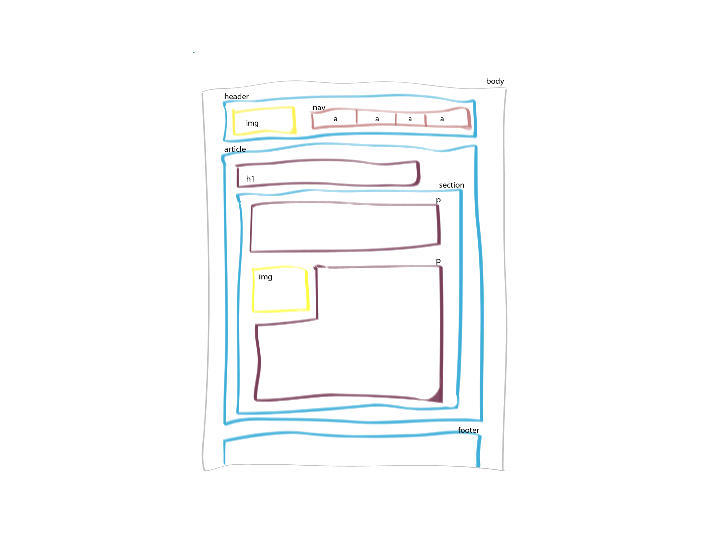

# Online Marketing Wirt - Modul Digitale Technologien

## Empfohlene Programme
- Editor: http://brackets.io/

## Vorarbeit

Entwurf der HTML Struktur einer Webseite auf einem Blatt Papier. 

## Projektarbeit
Programmierung und Gestaltung der entworfenen Webseite 

## Abgabe
Zip-Datei mit dem Inhalt des Ordners "projektarbeit" im moodle ablegen.

## Resourcen

 - HTML-Validator: https://validator.w3.org/#validate_by_input 
 - HTML-Tags: https://wiki.selfhtml.org/wiki/HTML#Elemente
 - CSS-Eigenschaften: https://wiki.selfhtml.org/wiki/CSS/Eigenschaften 
